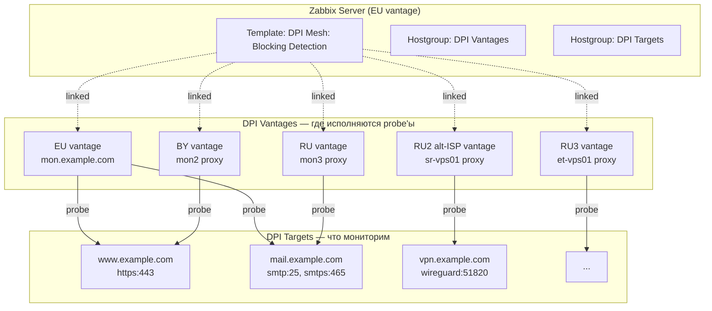
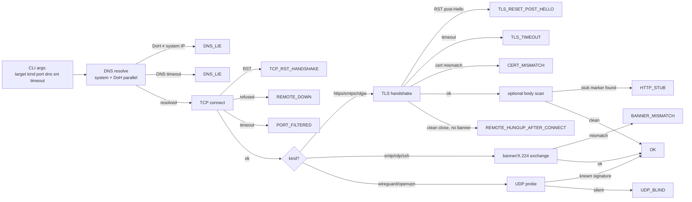
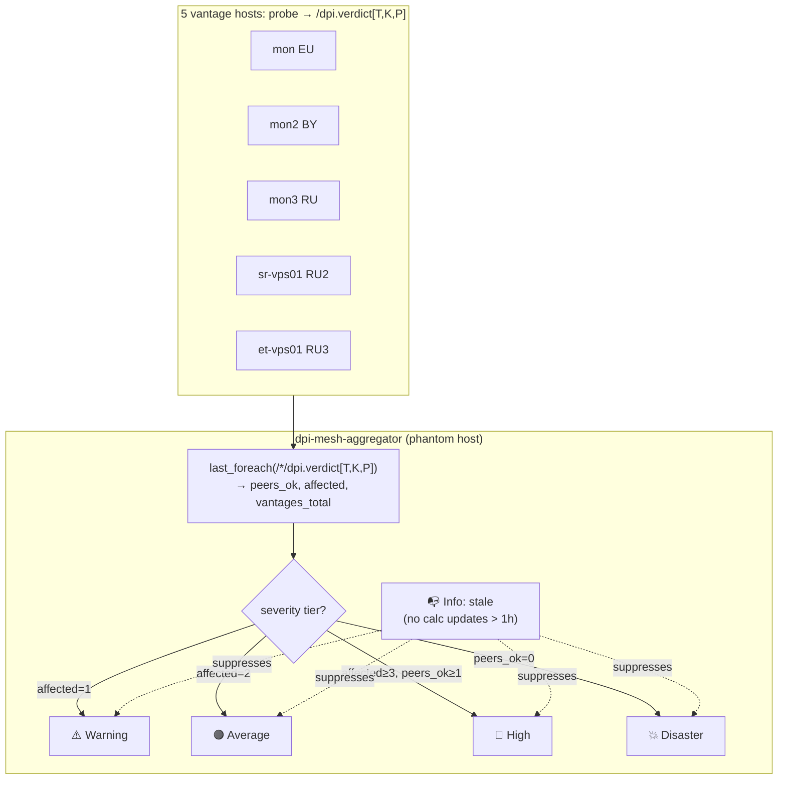

# DPI Mesh: Blocking Detection

Система обнаружения региональной блокировки сервисов (DPI/ТСПУ) на базе Zabbix 7.0.
Зонды запускаются с нескольких vantage-точек в разных регионах/у разных провайдеров
и классифицируют сбои по DPI-характерным паттернам. Алерт срабатывает по кворуму:
**одна точка видит блок, а ≥ N других сейчас видят OK** — подтверждённый
однонаправленный блок, а не общий outage сервиса.

## Содержание

- [Архитектура](#архитектура)
- [Структура репозитория](#структура-репозитория)
- [Коды вердиктов](#коды-вердиктов)
- [Поддерживаемые протоколы](#поддерживаемые-протоколы)
- [Зависимости](#зависимости)
- [Быстрый старт](#быстрый-старт)
- [Развёртывание зондов](#развёртывание-зондов)
- [Настройка целей мониторинга](#настройка-целей-мониторинга)
- [Ручной запуск зонда](#ручной-запуск-зонда)
- [Тесты](#тесты)
- [Известные особенности Zabbix External check](#известные-особенности-zabbix-external-check)
- [Источники и благодарности](#источники-и-благодарности)

---

## Архитектура



> Каждый vantage пробивает все таргеты независимо. Cross-vantage сравнение
> делается на стороне Zabbix через calculated item `dpi.peers_ok`, по которому
> 4-уровневая severity-шкала (Warning / Average / High / Disaster) различает
> локальный glitch, directional блок и глобальный outage (см. ниже).

**На каждом vantage-хосте** (`monitored_by=proxy`, pin к конкретному proxy для гео-привязки):

1. **LLD `dpi.targets.discovery`** — HTTP-agent делает `host.get` к Zabbix API. Запрос ходит
   под scoped read-only токеном пользователя `dpi-vantage` (роль `DPI Vantage`, права только
   на чтение hostgroup `DPI Targets`). Без `groupids` в теле — ACL фильтрует за нас.
   JS-preprocessing разворачивает `{$DPI.KINDS}` в строки `(target, kind, port)`.
2. **Master item** `dpi_probe[…]` типа EXTERNAL — Zabbix-server/proxy вызывает
   `/usr/lib/zabbix/externalscripts/dpi_probe` с позиционными аргументами. Скрипт всегда
   выводит ровно один JSON и завершается с кодом 0.
3. **Dependent items** парсят JSON: `dpi.verdict`, `dpi.latency_ms`,
   `dpi.bytes_before_fail`, `dpi.resolved_ip`, `dpi.reason`, `dpi.discriminator`.
   Отдельный master `dpi_probe[--control-only]` даёт `dpi.control_verdict` и
   `dpi.control_latency_ms`; целевые probe'ы запускаются с `--with-control` и
   возвращают `VANTAGE_UNAVAILABLE`, если сам vantage временно не видит
   нейтральный control endpoint.
4. **Calculated item `dpi.peers_ok`** считает агрегатом по всем vantage-хостам сколько из
   них СЕЙЧАС видят `verdict=OK` на этом же кортеже `(target, kind, port)`:
   `count(last_foreach(/*/dpi.verdict[…]), "eq", "OK")`.
5. **Триггеры** срабатывают по 4-уровневой шкале severity, привязанной к числу
   «здоровых» соседей `peers_ok` после debounce-окна в 3 последовательных
   non-OK измерения (см. таблицу в [Trigger severity ladder](#trigger-severity-ladder)).
   Disaster покрывает в т.ч. полный outage (`peers_ok=0`) — это сознательно
   изменено относительно ранней «quorum-only» схемы, чтобы глобально упавшие
   таргеты тоже алертили (наравне с availability-шаблонами, но другой канал).

### Probe pipeline



### Аггрегатор-хост и шкала severity

Система разделена на **два template-а**:

1. **`DPI Mesh Blocking Detection`** (vantage role, привязан к каждому из 5
   probe-хостов) — data layer: только LLD + master/dependent items
   (`dpi.verdict`, `dpi.reason`, `dpi.latency_ms`, ...). **Триггеров нет.**
2. **`DPI Mesh Aggregator`** (привязан к ОДНОМУ phantom-хосту
   `dpi-mesh-aggregator`) — consensus layer: три calculated items per
   `(target, kind, port)` + health calc `dpi.vantages_healthy` +
   4-tier severity ladder + Info-sentinel. `VANTAGE_UNAVAILABLE` исключается
   из `dpi.affected` и `dpi.vantages_total`, чтобы поломанный vantage не
   создавал ложный target-consensus.

Зачем aggregator-хост: триггеры на vantage-template materializ'ятся на
каждом из 5 vantages, и при глобальном outage **fire'ят 5 раз** —
оператор получает 5 одинаковых уведомлений. Aggregator держит триггер
в одном месте, поэтому один outage = один alert. Calculated items на
aggregator-е читают `/*/dpi.verdict[T,K,P]` (last_foreach across all
hosts) — sources данных остаются на vantages, агрегация — централизована.

Пять calc items на aggregator-е:
- `dpi.peers_ok[T,K,P]` = `count(last_foreach(/*/dpi.verdict[T,K,P]),"eq","OK")`
- `dpi.affected[T,K,P]` = `count(last_foreach(...),"ne","OK") − last(dpi.unavailable)` (без `VANTAGE_UNAVAILABLE`)
- `dpi.vantages_total[T,K,P]` = `count(last_foreach(...),"regexp",".") − last(dpi.unavailable)`
- `dpi.unavailable[T,K,P]` = `count(last_foreach(...),"eq","VANTAGE_UNAVAILABLE")`
- `dpi.discriminator_any[T,K,P]` = число vantage'ей, чей probe выделил HIGH-confidence
  DPI-fingerprint (TSPU RST source mismatch, TLS-post-Hello reset, RKN HTTP stub,
  DNS lie, и т.п.)

Каждый из 4 consensus-триггеров заканчивается финальной AND-cluase
`last(/.../dpi.discriminator_any[T,K,P])>=1`, поэтому **alert поднимается
только если хотя бы один vantage увидел attributable DPI-сигнатуру**.
Голый `PORT_FILTERED` (LOW confidence — ambiguous: RU ISP outbound :25
anti-spam, target firewall, generic drop) попадает в Latest data для
forensics, но никого не паджит. Шкала зашита арифметически через
`dpi.affected` (литеральные числа в `count(#3,"eq",N)=3`, поскольку
Zabbix не принимает `last(...)` в pattern-аргументе `count`), плюс
гарды по `dpi.vantages_total` — **шкала автоматически масштабируется**
при добавлении/удалении vantages, включая case `{$DPI.EXCLUDE_KINDS}`,
когда разные target'ы видны разному числу vantages:

| Условие (3× подряд) | Severity | Семантика | Гард |
|---------|:--------:|-----------|------|
| `affected = 1` AND `discriminator_any ≥ 1` | Info     | 1 vantage не видит, DPI-сигнатура есть — локальный directional блок | `vantages_total ≥ 2` |
| `affected = 2` AND `discriminator_any ≥ 1` | Warning  | 2 vantage не видит — directional блок одного региона | `vantages_total ≥ 3` |
| `affected ≥ 3 AND peers_ok ≥ 1` AND `discriminator_any ≥ 1` | Average | majority (но не все) | `vantages_total ≥ 4` |
| `peers_ok = 0` AND `discriminator_any ≥ 1` | High | глобально недоступен с подтверждённой DPI-сигнатурой | (нет гарда) |

Стоковые per-target service templates (`Template App HTTPS Service`,
`SMTP Service`, `RDP Service`) уже покрывают plain availability со своей
шкалой severity; DPI Mesh намеренно остаётся supplementary-сигналом —
отвечает на «это блокируют?», не на «это вообще живо?».

Debounce `#3` = три последовательных calc-цикла = ~15 мин при
`{$DPI.INTERVAL} = 5m`. Гарды (`vantages_total ≥ N`) держат тиры взаимоисключающими
при маленьких mesh-ах:

| Mesh size | Info | Warning | Average | High |
|----------:|:----:|:-------:|:-------:|:----:|
| 1 | —    | —       | —       | affected=1 (peers_ok=0) |
| 2 | =1   | —       | —       | =2       |
| 3 | =1   | =2      | —       | =3       |
| 4 | =1   | =2      | =3      | =4       |
| 5 | =1   | =2      | ∈{3,4}  | =5       |
| 6 | =1   | =2      | ∈{3,4,5}| =6       |

Каждый триггер несёт **операционные данные** (`opdata`), показываемые в
строке alert'а:
- `aff=X/Y dpi=N` — нижние тиры; X из Y vantage'ей в non-OK, N увидели DPI-fingerprint
- `peers_ok=X/Y dpi=N` — «all affected» тир; X=0 на момент срабатывания,
  полезно при resolve

Sentinel **Info** trigger `DPI Mesh stale` поднимается, если calc item
`dpi.peers_ok` на aggregator-е не обновлялся в течение `{$DPI.NODATA_WINDOW}`
(по умолчанию `1h`) — диагностика «aggregator замёрз или mesh замолчал». Все 4
severity-tiers зависят (`dependencies`) от sentinel-а: мёртвый aggregator не должен
генерировать ложные Disaster-ы.



---

## Структура репозитория

```
dpi-checker/
├── probe/
│   ├── dpi_probe.py             — CLI-диспетчер, точка входа для Zabbix
│   ├── lib/
│   │   ├── verdict.py           — VerdictCode (StrEnum) + Verdict + to_json()
│   │   ├── resolver.py          — DNS resolver (потокобезопасный таймаут)
│   │   ├── logger.py            — опциональный syslog-логгер (DPI_PROBE_SYSLOG=1)
│   │   ├── probe_https.py       — HTTPS зонд (TLS, SNI, опц. cert fingerprint)
│   │   ├── probe_smtp.py        — SMTP / SMTPS зонд (banner check)
│   │   ├── probe_rdp.py         — RDP зонд (X.224 Connection Request)
│   │   ├── probe_rdgw.py        — RD Gateway зонд (HTTPS handshake)
│   │   ├── probe_ssh.py         — SSH зонд (banner)
│   │   ├── probe_wireguard.py   — WireGuard зонд (UDP handshake_init)
│   │   └── probe_openvpn.py     — OpenVPN зонд (UDP/TCP HARD_RESET_CLIENT_V2)
│   └── tests/                   — pytest-сьюты (mock через 127.0.0.1:0)
├── template/
│   ├── dpi-mesh-blocking-detection.yaml  — vantage template: probe + verdict items
│   ├── dpi-mesh-aggregator.yaml          — aggregator template: calc items + 4-tier triggers
│   └── tests/                            — pytest-проверки структуры обоих шаблонов
├── deploy/
│   ├── install-prober.sh        — идемпотентный установщик (root, локально на хосте)
│   ├── deploy-to.sh             — one-shot remote install с рабочей станции
│   └── README.md                — короткая операторская инструкция (EN)
├── .github/workflows/ci.yml     — ruff + mypy + pytest + shellcheck на push
├── pyproject.toml               — ruff/mypy/pytest конфигурация
├── LICENSE                      — MIT
├── README.md                    — этот файл (RU, полный руководство)
└── README.en.md                 — короткий summary на английском
```

---

## Коды вердиктов

| Код | Описание | Типичная причина |
|-----|----------|-----------------|
| `OK` | Успешно | — |
| `TCP_RST_HANDSHAKE` | RST во время TCP-рукопожатия | Блокировка по IP/порту на сетевом уровне |
| `TCP_RST_MID_STREAM` | RST после начала передачи данных | DPI вмешивается в середине сессии |
| `TLS_RESET_POST_HELLO` | RST после ClientHello | Блокировка по SNI (DPI видит имя домена) |
| `TLS_TIMEOUT` | Зависание в середине TLS-рукопожатия | «Скраббер» ТСПУ заглушил соединение |
| `CERT_MISMATCH` | Неожиданный TLS-сертификат | Подозрение на MITM / подмену сертификата |
| `BANNER_MISMATCH` | SMTP/SSH баннер не соответствует ожидаемому | Редирект на заглушку / прокси-баннер |
| `REMOTE_HUNGUP_AFTER_CONNECT` | TCP/TLS подключение принято, но peer закрылся без protocol response | Часто слабый сигнал: remote policy, middlebox или перегруз |
| `VANTAGE_UNAVAILABLE` | Control-probe vantage'а не прошёл | Измерение target'а не выполнялось; исключается из consensus denominator |
| `DNS_LIE` | Системный resolver отдаёт IP отсутствующий в DoH-ответе | DNS-спуфинг или DNS-уровневая блокировка |
| `HTTP_STUB` | После TLS пришла страница-заглушка («доступ ограничен», «роскомнадзор», …) | Operator-уровень MITM с подменой контента |
| `ROUTE_BLACKHOLE` | ICMP admin-prohibited или нет маршрута | Блокировка на уровне маршрутизации |
| `PORT_FILTERED` | Таймаут TCP-подключения, без RST | «Тихая» блокировка, пакеты дропаются |
| `REMOTE_DOWN` | Connection refused | Сервис не запущен (не блокировка) |
| `UDP_BLIND` | UDP-зонд не смог классифицировать | Нет ответа на WireGuard/OpenVPN пакеты |
| `ERROR_INTERNAL` | Сбой самого зонда | Ошибка окружения или баг зонда |

Все коды зарегистрированы в value map `DPI verdict` внутри шаблона Zabbix.

### Confidence

Каждый JSON-вердикт также содержит поле `confidence` (`HIGH`/`MEDIUM`/`LOW`),
автоматически выведенное из `verdict` кода. Полезно для маршрутизации алертов:

- **HIGH** — smoking-gun сигнатуры, малая вероятность false-positive:
  `OK`, `DNS_LIE`, `TCP_RST_MID_STREAM`, `TLS_RESET_POST_HELLO`,
  `CERT_MISMATCH`, `HTTP_STUB`
- **MEDIUM** — типичный паттерн блока, но возможны другие причины:
  `TCP_RST_HANDSHAKE`, `TLS_TIMEOUT`, `BANNER_MISMATCH`, `ROUTE_BLACKHOLE`
- **LOW** — слабый или неоднозначный сигнал:
  `REMOTE_HUNGUP_AFTER_CONNECT`, `VANTAGE_UNAVAILABLE`, `PORT_FILTERED`,
  `REMOTE_DOWN`, `UDP_BLIND`, `ERROR_INTERNAL`

По умолчанию exposed только в master-item JSON; чтобы выделить в отдельный
dependent item, добавь item prototype с JSONPATH `$.confidence`.

### Discriminator

Для HTTPS и SMTPS non-OK вердиктов probe запускает короткие follow-up проверки:
wrong-SNI на тот же IP и, если DoH видел другой IP, прямой probe на DoH-IP.
Результат записывается в optional поле `discriminator`:

| Значение | Смысл |
|---|---|
| `sni_based` | Исходный probe non-OK, а wrong-SNI на тот же IP проходит |
| `dns_based` | Исходный IP non-OK, но альтернативный DoH-IP проходит |
| `inconclusive` | Follow-up'ы не отделили SNI/DNS/IP уровень |

Это operator context, не отдельный verdict. Phase 0 показала, что wrong-SNI
надёжнее использовать именно как disambiguator, а не как самостоятельное
доказательство SNI-DPI.

### DNS-уровневая защита

`probe/lib/doh_resolver.py` делает параллельный lookup через Cloudflare DoH
(1.1.1.1) при каждом probe одновременно с системным resolver'ом. Логика:

| Случай | Verdict | Логика |
|---|---|---|
| System resolver fails AND DoH returns IPs | `DNS_LIE` HIGH | Имя валидное (DoH ответил) → блок локальный, не NXDOMAIN |
| System resolver fails AND DoH also fails | `ERROR_INTERNAL` | Скорее всего typo / реальный NXDOMAIN |
| System returns IP, DoH returns different IP-set | (нет override) | **Только информационный сигнал**, записывается в `extra.doh_ips`. CDN edge variance на легитимных сервисах регулярно даёт mismatch — auto-fire создавал бы шум |
| System returns IP, TCP/TLS не работает с этим IP | TLS_TIMEOUT / RST / etc. | Connection-level verdict — ground truth. Если DoH тоже видел этот IP → real outage; если DoH видел другие → operator может посмотреть в extra |

**Почему mismatch не auto-fire'ит DNS_LIE** (выученный урок из live deploy):
крупные CDN (Google, Meta, Akamai, Fastly) маршрутизируют clients к разным
edge'ам по геолокации. Hetzner DNS и Cloudflare DoH видят разные edges того
же CDN — все валидные. На EU vantage IP-set mismatch появляется на youtube,
facebook, twitter, linkedin — все «false positive», не блокировки.
Connection-level verdicts (TCP/TLS handshake) — единственный надёжный
ground truth для «работает / не работает».

### Известные ограничения (Limitations)

- **Single DoH provider**: cross-check ходит только в Cloudflare (1.1.1.1).
  Если cам Cloudflare DoH хайджачен по пути или отвечает региональным
  edge'ом — false-positive в `extra.doh_ips` (но не в verdict, см. выше).
  Для v2 рассматривается consensus из 2-3 провайдеров (Quad9, Google).
- **IPv4-only**: probes используют `AF_INET` сокеты; DoH запрашивает только
  type=A. На IPv6-only target probe не сможет connect'нуться. v6-aware
  probe — задача будущего.
- **HTTP_STUB markers**: список marker'ов по умолчанию нацелен на RKN-style
  stub-страницы (RU). Для других юрисдикций (Iran, China) операторы могут
  передать кастомный список через `probe(..., stub_markers=...)` или
  отключить body-scan через `DPI_PROBE_HTTP_BODY=0`.
- **DoH IP-mismatch — info only**: CDN edge variance делает auto-DNS_LIE на
  IP-mismatch ненадёжным. Connection-level verdicts (TCP/TLS) — ground truth.
  DoH IPs только в `extra.doh_ips` для forensic.

---

## Поддерживаемые протоколы

| `--kind` | Порт по умолчанию | Что проверяет |
|----------|------------------|---------------|
| `https` | 443 | TLS-рукопожатие, SNI, опционально fingerprint сертификата |
| `smtp` | 25 | TCP + SMTP-баннер (STARTTLS не выполняется) |
| `smtps` | 465 | TLS + SMTP-баннер |
| `rdp` | 3389 | RDP COOKIE MSTSHASH → NegotiationResponse |
| `rdgw` | 443 | RD Gateway HTTP CONNECT |
| `ssh` | 22 | TCP + SSH banner |
| `wireguard` | 51820 | UDP → WireGuard Handshake Initiation (без валидного ключа) |
| `openvpn` | 1194 | UDP/TCP → OpenVPN HARD_RESET_CLIENT_V2 |

### New probe kinds (added 2026-05-14)

| Kind | Purpose | TSPU signature it catches |
|---|---|---|
| `https-bytes` | Push 32 KB after TLS handshake | `THROTTLE_DETECTED` if RST lands in the 14-34 KB window |
| `tls-frag` | ClientHello in 4-byte TCP segments | Fragmentation bypass signal for SNI-parser DPI |
| `tspu-liveness` | Aggregate canary-SNI probe | `TSPU_ACTIVE` flag per vantage |
| `wg-rekey` | Forced fresh WireGuard handshake | `WG_REKEY_PASS` / `WG_REKEY_BLOCKED` |
| `quic` | RFC-9000 Initial packet | `PORT_FILTERED` if QUIC/UDP is dropped |

`wg-rekey` deployment requires `/usr/bin/wg`, passwordless sudo for the
`zabbix` user via `deploy/sudoers.d/dpi-probe`, and per-peer config via
environment variables: `DPI_WG_REKEY_IFACE`, `DPI_WG_REKEY_PEER`,
`DPI_WG_REKEY_ORIG_EP`, `DPI_WG_REKEY_ALLOWED_IPS`,
`DPI_WG_REKEY_KEEPALIVE` (optional, default `25`), and
`DPI_WG_REKEY_PING` (optional AllowedIPs target to force traffic).

`tspu-liveness` canary SNIs are configurable via
`DPI_TSPU_LIVENESS_SNIS` (comma-separated). Default:
`rutracker.org,x.com,www.linkedin.com`.

---

## Примеры probe-вывода

Probe всегда возвращает один JSON-объект в stdout, exit code 0. Полный shape:

```json
{
  "verdict": "OK",
  "reason": "TLS handshake completed",
  "latency_ms": 123.4,
  "bytes_before_fail": 0,
  "resolved_ip": "203.0.113.10",
  "confidence": "HIGH",
  "extra": {"cipher": "TLS_AES_256_GCM_SHA384", "cert_bytes": 982}
}
```

**Типичные verdicts по типам блокировки:**

```json
// 1. Сервис работает (handshake прошёл, body чистый)
{"verdict":"OK","reason":"TLS handshake completed","latency_ms":143.7,
 "resolved_ip":"203.0.113.42","confidence":"HIGH",
 "extra":{"cipher":"TLS_AES_256_GCM_SHA384","cert_bytes":923}}

// 2. RKN DNS-уровневая блокировка с подменой IP
{"verdict":"DNS_LIE","reason":"system resolver returned 157.240.0.174 but DoH (Cloudflare) says ['31.13.72.174'] — DNS-level interception suspected",
 "latency_ms":125.1,"resolved_ip":"157.240.0.174","confidence":"HIGH",
 "extra":{"doh_ips":["31.13.72.174"]}}

// 3. ТСПУ-скраббер режет TLS handshake (SNI-based block)
{"verdict":"TLS_TIMEOUT","reason":"TLS handshake timeout / SSL error: _ssl.c:983: The handshake operation timed out",
 "latency_ms":10100,"resolved_ip":"31.13.72.36","confidence":"MEDIUM",
 "discriminator":"sni_based","extra":{"wrong_sni_verdict":"OK"}}

// 4. ISP-уровневый outbound :25 anti-spam фильтр
{"verdict":"PORT_FILTERED","reason":"TCP connect timeout (no SYN-ACK)",
 "latency_ms":5074,"resolved_ip":"65.21.80.247","confidence":"LOW","extra":{}}

// 5. Operator-MITM с stub-страницей (роскомнадзор / доступ ограничен)
{"verdict":"HTTP_STUB","reason":"RKN-style stub page detected (marker 'роскомнадзор')",
 "latency_ms":234,"resolved_ip":"5.3.3.17","confidence":"HIGH",
 "extra":{"cipher":"TLS_AES_256_GCM_SHA384","cert_bytes":1432,"stub_marker":"роскомнадзор"}}

// 6. Vantage временно не может выполнить достоверное измерение
{"verdict":"VANTAGE_UNAVAILABLE","reason":"control probe failed before target probe: TCP connect timeout",
 "latency_ms":1000,"resolved_ip":"","confidence":"LOW","extra":{"control_verdict":"PORT_FILTERED"}}
```

**Cross-vantage матрица** — пример того, как Zabbix Latest data рендерит одинаковый
target с 5 vantage'ей:

| target/kind/port | EU (mon) | BY (mon2) | RU (mon3) | RU2 (sr-vps01) | RU3 (et-vps01) |
|---|---|---|---|---|---|
| `www.example.com` https:443 | ✅ OK | ✅ OK | ✅ OK | ✅ OK | ✅ OK |
| `mail.example.com` smtp:25 | ✅ OK | (skip — self) | ✅ OK | ⚠ PORT_FILTERED | ⏸ skip (EXCLUDE_KINDS) |
| `blocked-service.com` https:443 | ✅ OK | ✅ OK | 🚫 TLS_TIMEOUT | ✅ OK | 🚫 DNS_LIE |

В этом примере fires (severity подбирается по `peers_ok`):
- `blocked-service.com` на mon3 (RU): peers_ok=3, discriminator_any=1 → **Warning** 🟡 (2 vantage не видит)
- `mail.example.com` на sr-vps01 (RU2): peers_ok=2, discriminator_any=0 → **не fires** (нет DPI-сигнатуры — это RU ISP outbound :25 filter, forensic-only)

EU/BY/RU на blocked-service не fires (verdict=OK, debounce =3 не достигнут).
Если бы все 5 vantage увидели non-OK на одном таргете с подтверждённой
DPI-сигнатурой — fired бы **High** 🔴 (genuine TSPU/RKN-style global block).

---

## Зависимости

**Зонд (runtime):** только стандартная библиотека Python 3.11. Никаких pip-пакетов.

**Разработка и тесты:**

```toml
# pyproject.toml
[dev-dependencies]
pytest, mypy, ruff
```

---

## Быстрый старт

### 1. Импорт шаблонов в Zabbix

В веб-интерфейсе: **Configuration → Templates → Import** — импортировать
**оба** YAML по очереди:
1. `template/dpi-mesh-blocking-detection.yaml` (vantage role — привязывается к probe-хостам)
2. `template/dpi-mesh-aggregator.yaml` (aggregator role — привязывается к одному phantom-хосту)

Или через API:

```bash
curl -s https://your-zabbix/api_jsonrpc.php \
  -H 'Content-Type: application/json' \
  -d '{
    "jsonrpc": "2.0", "method": "configuration.import", "id": 1,
    "auth": "YOUR_API_TOKEN",
    "params": {
      "format": "yaml",
      "rules": {"templates":{"createMissing":true,"updateExisting":true}, ...},
      "source": "<содержимое yaml-файла>"
    }
  }'
```

### 2. Создать группу хостов `DPI Targets`

**Configuration → Host groups → Create host group** → `DPI Targets`.

Числовой ID запоминать не нужно — LLD-запрос ходит под scoped токеном, который
видит только эту группу (см. шаг 3).

### 3. Создать read-only пользователя для LLD-запроса

Чтобы у каждого vantage был минимальный blast-radius (даже при компрометации
proxy-машины) — отдельный пользователь только с правом `host.get` / `hostgroup.get` /
`usermacro.get` и read-only на одну группу:

1. **Administration → User roles → Create user role** → `DPI Vantage`
   - Тип: `User`
   - UI default access / Modules / Actions: **Denied**
   - API access: **Enabled**, mode: **Allow list**
   - Allow list: `host.get`, `hostgroup.get`, `usermacro.get`
2. **Administration → User groups → Create user group** → `DPI Vantage`
   - Frontend access: **Disabled**
   - Permissions → read on group `DPI Targets`, deny на всё остальное
3. **Administration → Users → Create user** → `dpi-vantage`
   - User group: `DPI Vantage`
   - Role: `DPI Vantage`
4. **Administration → API tokens → Create API token** под пользователем `dpi-vantage`,
   **по одному токену на vantage** (для аудита и поштучной ротации).

### 4. Привязать шаблон к vantage-хостам

Каждый vantage — отдельный логический Zabbix-хост (можно сложить в группу
`DPI Vantages` для удобства), привязанный к конкретному proxy через `monitored_by=1`,
`proxyid=<свой>` — гарантирует что external check всегда исполняется в правильной
географии (а не через HA-failover на другой proxy).

На каждом vantage:

1. **Configuration → Hosts → [vantage] → Templates** → `DPI Mesh: Blocking Detection`
2. **Configuration → Hosts → [vantage] → Macros** → задать токен:

| Макрос | Пример | Назначение | Тип |
|---|---|---|---|
| `{$DPI.API_TOKEN}` | `<64-hex>` | API-токен, выпущенный под `dpi-vantage` для именно этого vantage | **Secret** (type=1) |

Всё остальное наследуется из template-defaults и обычно переопределять не нужно:

| Template default | Значение | Когда переопределить per-host |
|---|---|---|
| `{$DPI.API_URL}` | `https://your-zabbix.example.com/api_jsonrpc.php` | Только если фронтенд Zabbix на другом URL или с vantage есть быстрый внутренний путь |
| `{$DPI.INTERVAL}` | `5m` | Если нужно учащение/разрежение опроса для отдельного vantage |
| `{$DPI.PROBE_TIMEOUT}` | `10` | Если сеть с vantage медленнее обычной |
| `{$DPI.NODATA_WINDOW}` | `1h` | Окно для stale-data trigger; уменьшать только если нужен более быстрый сигнал «probe умер» |
| `{$DPI.CERT_FINGERPRINT}` | пусто | На target host, если нужно pin'ить HTTPS/SMTPS leaf certificate SHA-256 |
| `{$DPI.SELF_TARGETS}` | `^$` | На vantage, который сам же хостит часть DPI Targets (NAT hairpinning), см. ниже |
| `{$DPI.EXCLUDE_KINDS}` | `^$` | На vantage, чей ISP фильтрует целые kinds outbound (типично `^(smtp|smtps)$` для RU/CIS), см. ниже |

Control endpoint для `--with-control` задаётся в окружении prober'а, а не
Zabbix macro: `DPI_CONTROL_HOST`, `DPI_CONTROL_PORT`, `DPI_CONTROL_TIMEOUT`.
По умолчанию используется нейтральный HTTPS endpoint; если ваша сеть режет
его, переопределяйте одинаково на всех vantages.

> **Замечание про severity:** ladder привязан к `dpi.affected` (литералы `1`,
> `2`, `≥3` в `count(#3,"eq",N)=3`) плюс гейты по `dpi.vantages_total` — он
> **автоматически масштабируется** при добавлении/удалении vantages, и менять
> ничего не нужно. Если всё же хочется поменять семантику (например, поднять
> Warning из affected=1 до affected=2), править надо trigger expressions в
> `template/dpi-mesh-aggregator.yaml`, а не макросы. Severity ladder живёт
> на template `DPI Mesh Aggregator`, не на vantage.

> **Не переименовывайте technical name шаблонов.** Trigger expressions ссылаются
> на `/DPI Mesh Aggregator/dpi.peers_ok[...]` и `/DPI Mesh Blocking Detection/...`
> литерально. Если переименовать `template` поле в YAML перед import-ом,
> Zabbix молча создаст шаблон под новым именем, триггеры импортируются, но
> их условия никогда не сработают (path в expression больше не совпадёт с
> hostname после линковки на host). CI-тест
> `test_template_identity` ловит drift на стороне YAML, но не вашу ручную
> правку перед import.

> **HTTPS API доступ:** vantage-машинам нужно достучаться до Zabbix-фронтенда на `:443`.
> Если перед фронтендом стоит HAProxy / Hetzner Cloud LB / иной L7 с source-IP-фильтром —
> разрешить публичные IP всех vantage-хостов на path `/api_jsonrpc.php`. Иначе LLD будет
> отдавать 503 без видимой причины (nginx-логи будут пустыми — запрос блокируется выше).

### 5. Создать aggregator-хост и привязать aggregator template

Aggregator — это **один phantom-host** на весь mesh, без агента и интерфейсов.
Держит только calc items и triggers, читает `/*/dpi.verdict[...]` из БД Zabbix.

1. **Configuration → Hosts → Create host**:
   - Host name (technical): `dpi-mesh-aggregator` (произвольно; trigger expressions
     в template ссылаются через template-имя, Zabbix подменяет их на host-имя
     автоматически при линковке)
   - Visible name: `DPI Mesh Aggregator` или любое для UI
   - Groups: `DPI Vantages` (или отдельная группа — не критично)
   - Interfaces: **none** (агента нет, проверок нет)
   - Monitored by: **Server** (calc items выполняются на Zabbix server)
   - Templates: `DPI Mesh Aggregator`
2. **Macros**: задать `{$DPI.API_TOKEN}` (тот же scoped `dpi-vantage` токен,
   что и на vantage'ах — можно переиспользовать один) и `{$DPI.API_URL}`
   (реальный URL фронтенда).

Aggregator поднимет ту же LLD (одинаковые tuples что и vantages), материализует
calc items per tuple (`dpi.peers_ok`, `dpi.unavailable`, `dpi.vantages_total`,
`dpi.affected`, `dpi.discriminator_any`) и 5 триггеров — четыре severity-tier +
один Info-sentinel. Отдельный `dpi.vantages_healthy` следит за control layer.
Первый calc-цикл = через `{$DPI.INTERVAL}` = 5m.

Для planned maintenance target'ов рекомендуемый operator pattern простой:
закрывать/подавлять события через Zabbix maintenance window на affected target
или aggregator event tags, а не менять verdict classifier. `trend.get` для
автоматической latency-correlation логики не требуется; Phase 0 показала, что
истории пока недостаточно, поэтому latency-based detection отложен.

### Миграция с v1 (single template)

Если у вас уже установлена ранняя версия (один template `DPI Mesh Blocking Detection`
с severity triggers на каждом vantage), миграция к двум-template архитектуре:

1. **Перед началом**: текущие PROBLEM-события закроются при удалении старых
   trigger prototypes — это нормально. История метрик (`dpi.verdict`,
   `dpi.latency_ms`, ...) сохраняется, т.к. item prototypes data-layer'а
   не трогаются.
2. **Re-import vantage template** с `Delete missing → Items / Triggers / Discovery rules: yes`
   через **Configuration → Templates → Import**. Это удалит:
   - 4 severity trigger prototypes (Warning/Average/High/Disaster)
   - 1 stale trigger prototype (`DPI probe stale`) — будет заменён новым Info-level
     prototype-ом
   - 2 calc item prototypes (`dpi.peers_ok`, `dpi.vantages_total`) на vantage уровне
   - Macro `{$DPI.QUORUM}` (если был — больше не используется)
3. **Import aggregator template** (новый, нет конфликтов с v1).
4. **Создать phantom-хост `dpi-mesh-aggregator`** (шаг 5 выше). После
   первого LLD-цикла материализуются новые consensus-триггеры.
5. **Опционально**: убрать host-level override `{$DPI.QUORUM}` со всех vantage-хостов
   (макрос больше не используется, но не ломает ничего).

---

## Развёртывание зондов

На каждом вантажном хосте должен быть установлен Python-зонд. Есть три равноценных способа:

### Способ 1. One-shot из GitHub (рекомендуется для нового хоста)

```bash
# С рабочей станции, по SSH-алиасу (см. ~/.ssh/config):
./deploy/deploy-to.sh ifp-vps12 --from-git https://github.com/IT-for-Prof/zabbix-dpi-checker.git main

# Или напрямую на целевом хосте, через curl-pipe:
curl -fsSL https://raw.githubusercontent.com/IT-for-Prof/zabbix-dpi-checker/main/deploy/install-prober.sh \
  | sudo bash -s -- --from-git https://github.com/IT-for-Prof/zabbix-dpi-checker.git main
```

### Способ 2. rsync из локального чекаута

```bash
./deploy/deploy-to.sh ifp-vps12     # rsync + ssh + установщик в одну команду
```

### Способ 3. Ручной запуск установщика на хосте

```bash
ssh root@prober-host
git clone https://github.com/IT-for-Prof/zabbix-dpi-checker.git /tmp/dpi-checker
sudo /tmp/dpi-checker/deploy/install-prober.sh /tmp/dpi-checker
```

### Что делает установщик

1. Устанавливает Python 3.11+ (`dnf` на RHEL-family, `apt-get` на Debian-family).
   Принимает 3.11/3.12/3.13 — пробует в этом порядке.
2. Создаёт venv в `/opt/dpi-probe/venv` — только stdlib, pip-пакеты не нужны.
3. Разворачивает `probe/` в `/opt/dpi-probe/`.
4. Создаёт симлинк `/usr/lib/zabbix/externalscripts/dpi_probe` → `/opt/dpi-probe/dpi_probe`.
   Скрипт принимает позиционные аргументы напрямую (`target kind port dns sni timeout`)
   и сам бутстрапит `sys.path`, так что ни обёртка, ни `PYTHONPATH` не нужны.
5. Применяет права `root:zabbix 0750` на всё дерево (zabbix может читать, никто извне — нет).
   Применяется на каждом запуске, чтобы дрейф автоматически исправлялся.
6. Smoke-тест от пользователя `zabbix`: `runuser -u zabbix -- dpi_probe --help`.
   Падает с FATAL, если zabbix не может выполнить probe — это блокирует выкатку битого билда.

Установщик пишет журнал в `/var/log/dpi-probe/install.log` — туда же дописываются все
последующие запуски, что упрощает post-mortem.

### Опциональное syslog-логирование

По умолчанию probe пишет только JSON в stdout. Если выставить переменную окружения
`DPI_PROBE_SYSLOG=1` (например, через `/etc/zabbix/zabbix_proxy.conf` параметром
`StartExternalChecks` или systemd-overrides на zabbix-agent/proxy), каждый вызов будет
писать одну строку в syslog:

```
dpi_probe: target=mail.example.com kind=smtp port=25 dns=mail.example.com verdict=OK latency_ms=143.7 reason=SMTP banner ...
```

Удобно для пост-фактум анализа `journalctl -t dpi_probe` без захода в Zabbix UI.

### Идемпотентность

Повторный запуск установщика безопасен: Python не переустанавливается если уже
присутствует, venv пересоздаётся только при отсутствии. Обновление кода = `git pull` или
повторный `--from-git`, никаких ручных миграций.

---

## Настройка целей мониторинга

Каждый хост, который нужно проверять, должен быть добавлен в группу `DPI Targets`
и иметь следующие макросы:

| Макрос | Обязателен | Пример | Описание |
|--------|-----------|--------|----------|
| `{$DPI.DNS}` | да | `www.example.com` | DNS-имя или IP для подключения |
| `{$DPI.REGION}` | да | `EU` | Географический регион цели (RU/BY/EU) |
| `{$DPI.KINDS}` | да | `https:443,smtp:25,smtps:465` | Протоколы и порты через запятую |
| `{$DPI.SNI}` | нет | `example.com` | TLS SNI (по умолчанию = `{$DPI.DNS}`) |
| `{$DPI.WG.PUBKEY}` | нет | `base64==` | WireGuard публичный ключ сервера |
| `{$DPI.OVPN.MODE}` | нет | `udp` | OpenVPN транспорт: `udp` или `tcp` |

**Формат `{$DPI.KINDS}`:**

```
https:443,smtp:25,smtps:465,rdp:3389,ssh:22
```

Каждый элемент — `kind:port`. LLD создаёт отдельный master-элемент и 5 dependent-элементов
на каждую пару, плюс calculated item `dpi.peers_ok` для кворумной агрегации.

### Per-vantage exclusions (self-hosted targets и ISP-фильтры)

LLD на каждом vantage поддерживает два независимых regex-фильтра, отсекающих часть
кортежей до создания items. Default обоих = `^$` (фильтр выключен).

**`{$DPI.SELF_TARGETS}` — exclude by target host.** Когда vantage-машина сама хостит
один из DPI-таргетов: probe из этого vantage идёт сам в себя через публичный IP, NAT
hairpinning возвращает `REMOTE_DOWN`, что выглядит как directional block (соседи видят
OK). На этом vantage прописать regex имён, которые он хостит:

```
{$DPI.SELF_TARGETS} = ^(mail\.example\.com|relay\.example\.com)$
```

**`{$DPI.EXCLUDE_KINDS}` — exclude by kind (protocol/port).** Когда ISP vantage'а
применяет outbound-фильтр на конкретные kinds (типичный пример — многие RU/CIS-ISP
блокируют outbound `:25` ко всему миру для anti-spam). Все smtp/smtps verdicts с
такого vantage будут `PORT_FILTERED` — шум, не DPI-сигнал. Override:

```
{$DPI.EXCLUDE_KINDS} = ^(smtp|smtps)$
```

LLD пропускает кортежи, items не создаются, peers_ok на других vantage уменьшается на
1 для этих kinds — severity-ladder корректно адаптируется (потолок `peers_ok` ниже,
тиры сдвигаются автоматически).

---

## Ручной запуск зонда

Probe вызывается **позиционно** (Zabbix передаёт параметры из скобок ключа как `$1..$6`):

```
dpi_probe TARGET KIND PORT DNS [SNI] [TIMEOUT]
```

Примеры (запускать от того же пользователя, что и Zabbix — `zabbix`):

```bash
# HTTPS
runuser -u zabbix -- /usr/lib/zabbix/externalscripts/dpi_probe \
    target-stub https 443 www.example.com www.example.com 10

# SMTP — позиционно: target, kind, port, dns, sni (=dns если без TLS), timeout
runuser -u zabbix -- /usr/lib/zabbix/externalscripts/dpi_probe \
    target-stub smtp 25 mail.example.com mail.example.com 10

# SMTPS
runuser -u zabbix -- /usr/lib/zabbix/externalscripts/dpi_probe \
    target-stub smtps 465 mail.example.com mail.example.com 10

# SSH
runuser -u zabbix -- /usr/lib/zabbix/externalscripts/dpi_probe \
    target-stub ssh 22 bastion.example.com bastion.example.com 5

# WireGuard — без валидного pubkey: UDP_BLIND (см. caveat ниже)
runuser -u zabbix -- /usr/lib/zabbix/externalscripts/dpi_probe \
    target-stub wireguard 51820 vpn.example.com vpn.example.com 5

# OpenVPN UDP — режим зашит в зонд (по умолчанию udp)
runuser -u zabbix -- /usr/lib/zabbix/externalscripts/dpi_probe \
    target-stub openvpn 1194 vpn.example.com vpn.example.com 5
```

Поле `TARGET` используется только в логах и тегах; для ручного запуска можно передавать
любую строку (`target-stub`).

Пример вывода:

```json
{"verdict":"OK","reason":"TLS handshake completed","latency_ms":215.3,"bytes_before_fail":0,"resolved_ip":"93.184.216.34","extra":{"cipher":"TLS_AES_256_GCM_SHA384","cert_bytes":923}}
```

### Caveat: WireGuard

WG-сервера в продакшене валидируют MAC1 (BLAKE2s от тела пакета, ключом является
публичный ключ сервера). Без знания pubkey зонд отправляет пакет с нулевым MAC1, и
корректно настроенный сервер просто его дропнет — отличить блокировку от валидной
тишины невозможно. Поэтому без `pubkey_b64` зонд возвращает `UDP_BLIND`. Реальный
DPI-сигнал для WG получите только при программном вызове `probe_wireguard.probe(...,
pubkey_b64=...)` с правильным ключом.

---

## Тесты

### Тесты зонда

```bash
# Создать dev-окружение (один раз)
python3.11 -m venv .venv-dev
source .venv-dev/bin/activate
pip install pytest

# Запустить все тесты
pytest probe/tests/ -v
```

Тесты используют только mock/stub — сетевых соединений не требуют.

### Тесты шаблона

```bash
source .venv-dev/bin/activate
pip install pyyaml
pytest template/tests/ -v
```

Проверяют структуру YAML-шаблона:
- версия Zabbix ≥ 7.0
- наличие value map со всеми кодами вердиктов
- корректность UUID-реестра в заголовке
- LLD-правило с JAVASCRIPT-препроцессингом и нужными макросами
- master-элемент EXTERNAL с параметрами в скобках ключа (не в `params:`),
  `--with-control` и `{#CERT_FP}`
- control-only master `dpi_probe[--control-only]` и dependent items
  `dpi.control_verdict`, `dpi.control_latency_ms`
- JAVASCRIPT-препроцессинг вместо CHECK_JSON_ERROR
- dependent-элементы со ссылкой на master, включая `dpi.discriminator`

---

## Известные особенности Zabbix External check

Контракт между шаблоном и `dpi_probe` целиком определяется одной строкой в ключе
master-элемента:

```
dpi_probe[{#TARGET},{#KIND},{#PORT},{#DNS},{#SNI},{$DPI.PROBE_TIMEOUT}]
```

Текущий ключ target-probe в шаблоне расширен:

```
dpi_probe[{#TARGET},{#KIND},{#PORT},{#DNS},{#SNI},{$DPI.PROBE_TIMEOUT},{#CERT_FP},--with-control]
```

Что отсюда следует — и почему это **важно знать** прежде чем что-то менять:

- **Имя файла = префикс ключа до `[`.** Zabbix ищет `dpi_probe` буквально по
  имени в `ExternalScripts`-каталоге; переименование требует изменения и шаблона.
- **Аргументы — позиционные.** Zabbix разбивает содержимое скобок по запятым и
  передаёт каждый кусок как отдельный `argv[]`. Не одна строка через запятую,
  не `--key=value`. Сам скрипт принимает позиционные аргументы через argparse.
- **Макросы раскрываются на этапе вызова.** `{$DPI.PROBE_TIMEOUT}` подставляется
  числом до запуска скрипта. Fallback в коде не нужен (но default в шаблоне есть — `10`).
- **`{#CERT_FP}` берётся из target macro `{$DPI.CERT_FINGERPRINT}`.** Пустое
  значение отключает cert pinning; непустое значение сравнивается с SHA-256
  leaf certificate для HTTPS/SMTPS.
- **`--with-control` перед target probe запускает neutral outbound check.**
  Настраивается переменными окружения prober'а `DPI_CONTROL_HOST`,
  `DPI_CONTROL_PORT`, `DPI_CONTROL_TIMEOUT`. Для отдельного health item
  используется `dpi_probe[--control-only]`.
- **Поле `params:` для типа EXTERNAL игнорируется.** Не используем — все
  параметры идут через скобки. Тесты шаблона это проверяют.
- **Preprocessing на master отсутствует — `dpi_probe` обязан вернуть валидный JSON
  на любом code path.** Включая ошибки argparse: см. `_ZabbixSafeArgParser`,
  который перехватывает `error()` и эмитит `ERROR_INTERNAL` вместо `sys.exit(2)`.
  `CHECK_JSON_ERROR` бесполезен (срабатывает когда поле есть, а не когда JSON битый).
- **Скрипт всегда завершается с кодом 0.** Любой non-zero exit → Zabbix помечает
  item как NOTSUPPORTED, и dependent-элементы не получают значения.

---

## Источники и благодарности

Зонд реализован с нуля только на stdlib Python, но дизайн (taxonomy вердиктов,
паттерн «layered DNS→TCP→TLS», quorum-сравнение между vantage'ами) сложился
после изучения нескольких open-source DPI-чекеров и спецификаций протоколов.
Полный список с прямыми ссылками — в [`CREDITS.md`](CREDITS.md).

Кратко:

- **Протоколы**: RFC 5246 / RFC 8446 (TLS), RFC 5321 (SMTP), RFC 4253 (SSH),
  [MS-RDPBCGR](https://learn.microsoft.com/en-us/openspecs/windows_protocols/ms-rdpbcgr/18a27ef9-6f9a-4501-b000-94b1fe3c2c10)
  (RDP X.224), [WireGuard whitepaper](https://www.wireguard.com/papers/wireguard.pdf) §5.4,
  [OpenVPN protocol notes](https://community.openvpn.net/openvpn/wiki/SecurityOverview).
- **Zabbix 7.0**: [официальная документация](https://www.zabbix.com/documentation/7.0/en/manual),
  в особенности разделы про LLD JS-preprocessing, External check items и
  cross-host `last_foreach` / `count_foreach` в calculated items.
- **DPI-чекеры, повлиявшие на taxonomy вердиктов**:
  [rkn-block-checker](https://github.com/MayersScott/rkn-block-checker),
  [hyperion-cs/dpi-checkers](https://github.com/hyperion-cs/dpi-checkers),
  [Runnin4ik/dpi-detector](https://github.com/Runnin4ik/dpi-detector),
  [vernette/censorcheck](https://github.com/vernette/censorcheck),
  [LL33ch/dpi-rip](https://github.com/LL33ch/dpi-rip),
  [LordArrin/openwrt-dpi-checker](https://github.com/LordArrin/openwrt-dpi-checker).
- **Методология mesh-probe** для отделения directional блокировок от outage:
  [OONI](https://ooni.org/), [Censored Planet](https://censoredplanet.org/).
